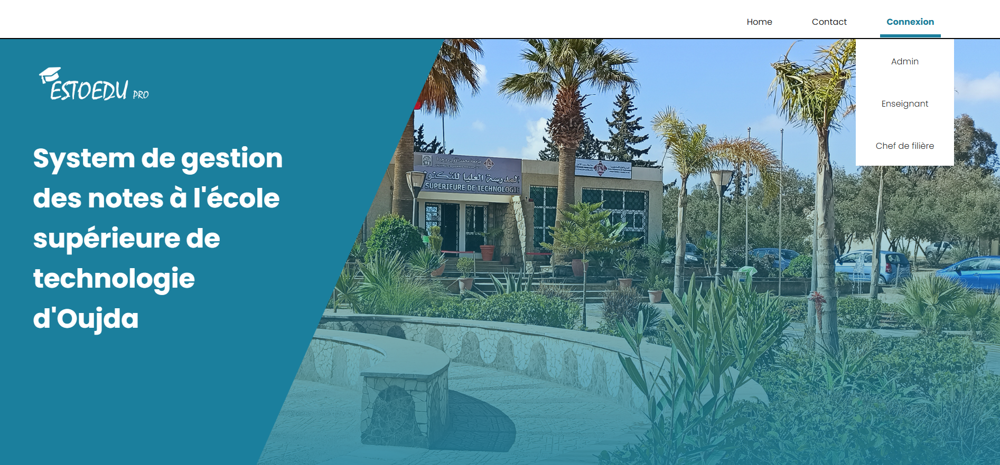

  <h1 align="center" style="color: #2c3e50;">📘 Application de Gestion des Notes</h1>

  

    Application web permettant la gestion des notes par module et matière, 
    facilitant les échanges entre enseignants et responsables de formation.
  

  

  <!-- ====================================================== -->
  <h2 style="color: #34495e;">🎯 Objectifs du projet</h2>
  <ul>
    <li>Centraliser et organiser les notes des étudiants.</li>
    <li>Gérer les modules, matières et barèmes.</li>
    <li>Faciliter la communication entre enseignants et administration.</li>
    <li>Assurer une interface simple, fonctionnelle et efficace.</li>
  </ul>

  <!-- ====================================================== -->
  <h2 style="color: #34495e;">🖥️ Fonctionnalités principales</h2>

  <!-- Remplace features.png par une image illustrant les fonctionnalités -->
  

    
  

  <ul>
    <li>Gestion des modules et matières.</li>
    <li>Ajout / modification des notes.</li>
    <li>Calcul automatique des moyennes.</li>
    <li>Exportation des notes.</li>
    <li>Authentification des enseignants.</li>
  </ul>

  <!-- ====================================================== -->
  <h2 style="color: #34495e;">🛠️ Technologies utilisées</h2>

  <!-- Remplace techs.png par une image qui représente les technologies -->
  

    
  

  <table style="border-collapse: collapse;">
    <tr><td style="padding: 8px; border: 1px solid #ddd;">HTML</td><td style="padding: 8px; border: 1px solid #ddd;">Structure de l’interface</td></tr>
    <tr><td style="padding: 8px; border: 1px solid #ddd;">CSS</td><td style="padding: 8px; border: 1px solid #ddd;">Mise en forme et design</td></tr>
    <tr><td style="padding: 8px; border: 1px solid #ddd;">JavaScript</td><td style="padding: 8px; border: 1px solid #ddd;">Interactions dynamiques</td></tr>
    <tr><td style="padding: 8px; border: 1px solid #ddd;">PHP</td><td style="padding: 8px; border: 1px solid #ddd;">Traitement backend</td></tr>
    <tr><td style="padding: 8px; border: 1px solid #ddd;">UML</td><td style="padding: 8px; border: 1px solid #ddd;">Modélisation du système</td></tr>
    <tr><td style="padding: 8px; border: 1px solid #ddd;">Diagramme de Gantt</td><td style="padding: 8px; border: 1px solid #ddd;">Planification du projet</td></tr>
  </table>
  <!-- ====================================================== -->
  <h2 style="color: #34495e;">🎞️ Démonstration</h2>

  <!-- Remplace demo.gif par un GIF montrant une fonctionnalité -->
  

    
  

  <!-- ====================================================== -->
  <h2 style="color: #34495e;">👨‍💻 Auteur</h2>

  

    Projet réalisé par <strong>Mohammed M’Barki</strong> 
    N'hésitez pas à proposer des améliorations ou ouvrir une issue !
  

